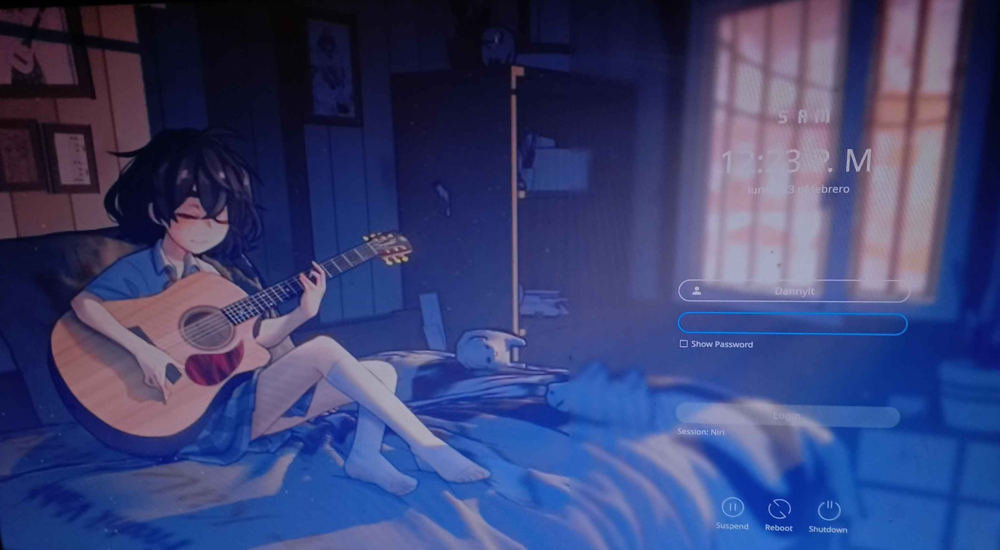

# sddm-perzonalido
#  SDDM Personalizado

Configuración de SDDM con tema Sugar Candy y fondo aleatorio en cada inicio.

##  Características
- Tema Sugar Candy
- Fondo aleatorio en cada arranque
- Avatar personalizado

##  Instalación
1. Copiar `theme.conf` a `/usr/share/sddm/themes/Sugar-Candy/`
2. Copiar `sddm-random-bg.sh` a `/usr/local/bin/` y darle `chmod +x`
3. Copiar `sddm-random-bg.service` a `/etc/systemd/system/`
4. Activar el servicio:
   systemctl enable sddm-random-bg.service
